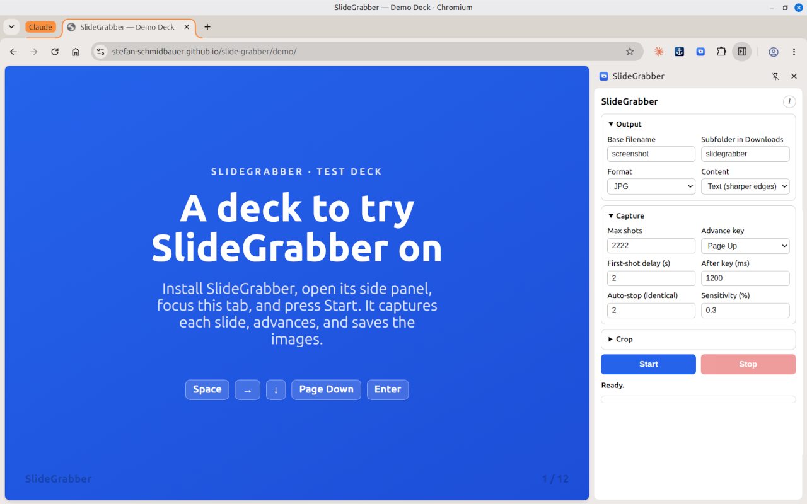

# SlideGrabber

A Chrome extension (Manifest V3) that captures a series of screenshots of the
current tab from the side panel, presses a key to advance the page between
shots, and saves the images — optionally cropped at the edges — locally.

Try it on the [demo deck](https://stefan-schmidbauer.github.io/slide-grabber/demo/).

## Installation

Requires Chrome 114 or newer (the side panel API).

1. Open `chrome://extensions/`.
2. Enable **Developer mode** in the top right.
3. Click **Load unpacked** and select this folder.
4. Click the extension icon → the side panel opens.

## Usage

In the side panel, configure:

- **File name (base)** – e.g. `slide` → files `slide_001.png`, `slide_002.png`, …
  Characters that aren't allowed in file names (`: * ?` …) are replaced with `_`.
- **Target folder** – a subfolder inside the Downloads folder (see note below).
  `a/b` nests folders; `..` segments are ignored.
- **File format** – PNG or JPG. For JPG you can choose whether the content is
  mostly *image* (smaller file) or *text* (sharper edges).
- **Maximum number of screenshots** – the process stops automatically afterwards.
- **Delay before the first screenshot** – gives you time to focus the target tab.
- **Key to advance the page** – Spacebar, Page Down/Up, arrow keys, or Enter.
- **Delay after key press** – a pause so the page can switch before the next shot.
- **Auto-stop after N identical pages** – stops the run once the page no longer
  changes (e.g. at the end of a slide deck), so you don't have to guess the exact
  count. `0` disables it. See *How auto-stop works* below.
- **Crop edges** – pixels for top/bottom/left/right. The saved image is smaller
  than the tab accordingly. Use **Capture preview** to drag the crop lines
  visually. The preview is taken with the debugging bar showing (see below), so
  it matches the real captures exactly — expect the bar to flash briefly and the
  preview to take about half a second longer.

**Start** begins: screenshot → key press → screenshot → key press → … up to the
maximum. **Stop** cancels at any time.

## How it works

1. Capture a screenshot of the visible tab area.
2. Optionally crop the edges.
3. Save as `<folder>/<file name>_<number>.<ext>`.
4. Press the advance key, wait briefly, repeat from step 1 — up to the maximum.

## How auto-stop works

When **Auto-stop after N identical pages** is greater than `0`, each new frame is
compared with the last saved one. If it looks the same (compared on a downscaled
copy, so antialiasing and a blinking cursor don't count), the frame is **not**
saved — the page is only advanced and a counter is increased. As soon as `N`
identical pages occur in a row, the run stops.

Why `N` and not `1`? At the real end of a deck, *every* further key press yields
the same frame, so the counter keeps climbing. A coincidental duplicate (e.g. two
blank slides in a row) is a one-off: the next key press reveals a different page
and resets the counter. The default `N = 2` therefore survives two identical
pages but still stops reliably at the end. Note the trade-off: three or more
genuinely identical pages in a row would be treated as the end — raise `N` for
such decks, or set `0` to disable.

- **Storage location:** Chrome extensions can only write to the **Downloads
  folder**. The “target folder” is therefore a subfolder underneath it
  (e.g. `Downloads/slidegrabber/`), not an arbitrary path.
- **Key press:** For a *real* key press (one that actually affects the page,
  e.g. to advance a slide) the `chrome.debugger` API is used. Chrome shows the
  “… is being debugged by an extension” bar while running. This is normal and
  disappears when you stop. Don't close the bar during a run — its close button
  detaches the debugger, which stops the capture.
- **Debugging bar and layout:** The bar slightly shrinks the visible area and
  reflows the page. SlideGrabber waits briefly after the bar appears so every
  frame shares the same layout — this keeps auto-stop reliable (otherwise the
  first frame, taken before the reflow, would look different from the rest) and
  keeps the **Capture preview** consistent with the saved images.
- Only the **visible** area of the active tab is captured (not a full-page
  scrolling screenshot). The tab that is active when the **first-shot delay**
  expires is the one that gets captured — that's what the delay is for. From
  then on it has to stay in the foreground: if you switch tabs mid-run,
  SlideGrabber stops rather than capture the wrong page, because Chrome always
  screenshots whatever tab is active while the advance key keeps going to the
  original one.

## Privacy

SlideGrabber does not collect, transmit, or share any data. All screenshots are
saved directly to your local Downloads folder. See [PRIVACY.md](PRIVACY.md) for
details.
