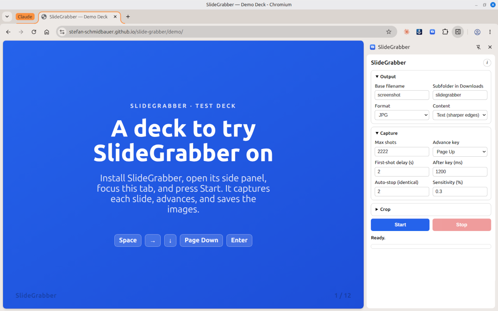

# SlideGrabber

A Chrome extension (Manifest V3) that captures a series of screenshots of the
current tab from the side panel, presses a key to advance the page between
shots, and saves the images — optionally cropped at the edges — locally.

It works with anything you page through with the keyboard: slide decks and
online presentations, online photo books and photo albums, or documents and text
shown page by page in a web viewer.

**[Install from the Chrome Web Store](https://chromewebstore.google.com/detail/slidegrabber/mhppbdinngcdcbgafcppmcchpfjgmlnk)**

Try it on the [demo deck](https://stefan-schmidbauer.github.io/slide-grabber/demo/).

## Installation

Requires Chrome 114 or newer (the side panel API).

### From the Chrome Web Store (recommended)

1. Open the [store listing](https://chromewebstore.google.com/detail/slidegrabber/mhppbdinngcdcbgafcppmcchpfjgmlnk)
   and click **Add to Chrome**.
2. Click the extension icon → the side panel opens.

### From source

For development, or to run a build you made yourself:

1. Clone this repository.
2. Open `chrome://extensions/`.
3. Enable **Developer mode** in the top right.
4. Click **Load unpacked** and select that folder.
5. Click the extension icon → the side panel opens.

## Usage

In the side panel, configure:

- **File name (base)** – e.g. `slide` → files `slide_001.png`, `slide_002.png`, …
  Characters that aren't allowed in file names (`: * ?` …) are replaced with `_`.
- **Target folder** – a subfolder inside the Downloads folder (see note below).
  `a/b` nests folders; `..` segments are ignored.
- **New folder per run** – *Yes* (default) saves each run into its own folder
  inside the target folder, named after the start time and the tab title, e.g.
  `20260928-191512_Quarterly Review`. The title is cleaned up and shortened to
  about 40 characters so the name works on Linux, macOS and Windows. *No* saves
  every run straight into the target folder; if a file already exists there,
  Chrome appends ` (1)` and the log shows the name actually used.
- **File format** – PNG or JPG. For JPG you can choose whether the content is
  mostly *image* (smaller file) or *text* (sharper edges).
- **Maximum number of screenshots** – the process stops automatically afterwards.
- **Delay before the first screenshot** – gives you time to focus the target tab.
- **Key to advance the page** – Spacebar, Page Down/Up, arrow keys, or Enter.
- **Delay after key press** – a pause so the page can switch before the next shot.
- **Auto-stop** – *Yes* stops the run once the page no longer changes (e.g. at
  the end of a slide deck), so you don't have to guess the exact count. *No*
  always runs up to the maximum. See *How auto-stop works* below.
- **Crop edges** – pixels for top/bottom/left/right. The saved image is smaller
  than the tab accordingly. Use **Capture preview** to drag the crop lines
  visually. The preview is taken with the debugging bar showing (see below), so
  it matches the real captures exactly — expect the bar to flash briefly and the
  preview to take about half a second longer.

**Start** begins: screenshot → key press → screenshot → key press → … up to the
maximum. **Stop** cancels at any time.

## How it works

1. Capture a screenshot of the visible tab area.
2. Optionally crop the edges.
3. Save as `<folder>/<run folder>/<file name>_<number>.<ext>` (without
   `<run folder>` when *New folder per run* is off).
4. Press the advance key, wait briefly, repeat from step 1 — up to the maximum.

## How auto-stop works

When **Auto-stop** is set to *Yes*, each new frame is compared with the last
saved one (on a downscaled copy, so antialiasing and a blinking cursor don't
count). A page that looks the same is **not** saved — duplicates are dropped.

- **Two identical pages in a row** (e.g. two blank slides): one is kept, and
  the run continues with the next page.
- **Three identical pages in a row:** treated as the end of the deck — one is
  kept and the run stops. This is how the real end is detected, because there
  every further key press shows the same page.

If a deck genuinely contains three or more identical pages in a row, set
auto-stop to *No*.

- **Storage location:** Chrome extensions can only write to the **Downloads
  folder**. The “target folder” is therefore a subfolder underneath it
  (e.g. `Downloads/slidegrabber/`), not an arbitrary path.
- **Key press:** For a *real* key press (one that actually affects the page,
  e.g. to advance a slide) the `chrome.debugger` API is used. Chrome shows the
  “… is being debugged by an extension” bar while running. This is normal and
  disappears when you stop. Don't close the bar during a run — its close button
  detaches the debugger, which stops the capture.
- **Debugging bar and layout:** The bar slightly shrinks the visible area and
  reflows the page. SlideGrabber waits briefly after the bar appears so every
  frame shares the same layout — this keeps auto-stop reliable (otherwise the
  first frame, taken before the reflow, would look different from the rest) and
  keeps the **Capture preview** consistent with the saved images.
- Only the **visible** area of the active tab is captured (not a full-page
  scrolling screenshot). The tab that is active when the **first-shot delay**
  expires is the one that gets captured — that's what the delay is for. From
  then on it has to stay in the foreground: if you switch tabs mid-run,
  SlideGrabber stops rather than capture the wrong page, because Chrome always
  screenshots whatever tab is active while the advance key keeps going to the
  original one.

## Privacy

SlideGrabber does not collect, transmit, or share any data. All screenshots are
saved directly to your local Downloads folder. See [PRIVACY.md](PRIVACY.md) for
details.
